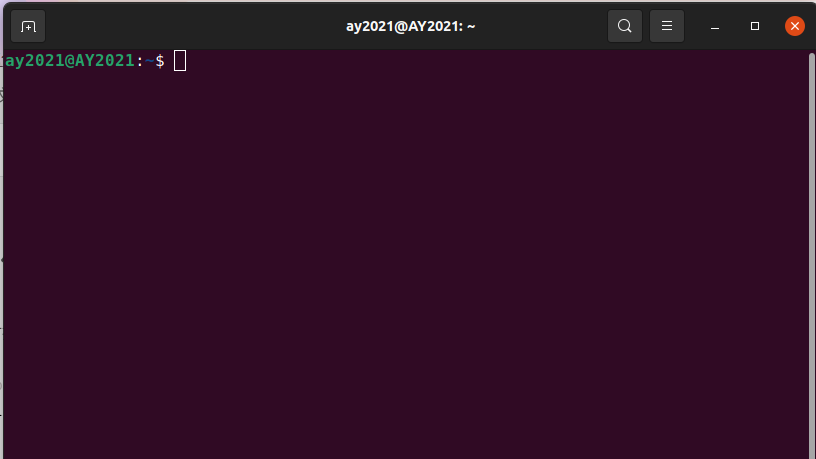
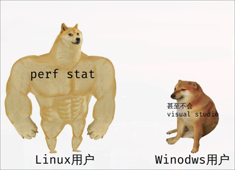

# Linux眼中的C程序

## 概述
+ **Q1** Linux下的C程序要如何运行？
+ **Q2** 感觉，。。。不如 Windows 编译？
+ **Q3** Linux正真的强大之处！何在？

---

# Q1：Linux下的C程序要如何运行？

----


首先！同时按下**ctrl+alt+t**，启动终端。
大概这样：


----

然后输入

```shell
# sudo是类似于Win中“使用管理员身份运行”的命令，一般在行首。
sudo passwd root 
```

给<blue>root（管理员）</blue>设个初始密码。
<br>
<br>

接着，我们就可以<red>更新</red>一下了。

```shell
# apt 是ubuntu的包管理命令，类似应用商店。
sudo apt update
```
<br>
为了编译C程序，我们需要安装一些工具。
```shell
# gcc 和 g++ 是用于编译的，gdb 用于调试。
# vim 是一个文本编辑器，对初学者可能不太友好（
sudo apt install gcc g++ gdb vim
```

----
## 编写C代码

我们先在Linux下创建文件夹用来存放代码。
```shell
# mkdir 是make directory的缩写，-p的意思是递归创建
# 这样就会在家目录下创建code文件夹
# 然后在code文件夹下创建c文件夹
mkdir -p ~/code/c/
# cd 就是change directory的缩写，也就是切换到c文件夹下
cd ~/code/c/
# Linux下使用vim编写frist_c.c文件
vim frist_c.c
```
<br>
在我们使用vim的时候，<red>**可怕的事情发生了**</red><br><br>
这玩意？怎么不能输入啊？<br>
为了解决这个问题，我们决定上网查阅。

[vim，菜鸟教程](https://www.runoob.com/linux/linux-vim.html)(当然，其实vimtutor也不错)

----
### vim的使用
好了，我们学成归来，知道了 vim 有很多个模式的，<br>
按下**i** 进入插入模式（编辑模式）<br>
>  依照惯例，输出hello ubuntu以示尊敬。
```c
#include <stdio.h>
int main(){
    puts("Hello ubuntu!\n");
    return 0;
}
```
接着按下ESC退出编辑模式，进入命令模式。<br>
输入<blue>:wq</blue>(注意最前面的冒号，别漏了)回车，<br>
我们已经很清楚Linux下有很多缩写了，<br>
很快我们就意识到，**w是write的缩写，q是quit的缩写。**<br>
这代表我们把刚才的**代码（文字）**写入文件，并退出vim了。

----
### <del>狠狠地</del>编译
现在又回到最开始的终端界面了。<br>
是时候编译了。<br>
```shell
# -o 表示输出，没有 -o frist.out的话，默认生成a.out文件
gcc frist_c.c -o frist.out
# ls，list的缩写，就是列出的意思Windows编译WindoWindows编译
# . 代表的是当前文件夹（.. 是上一层文件夹）
ls .
# 我们应该可以看到frist.out文件Windows编译Windows编ndows编译
# ./就是运行这个文件，如果这个文件可以运行的话
./frist.out
```
Linux下该可以在终端界面看到输出的文字了。<br><br>
Linux下的编译貌似有点繁琐，感觉，**不如。。。Windows 编译。**

---

# Q2：感觉，**不如...Windows 编译。**
真的是这样吗？为什么要用这样繁琐的编译方式？

----

> 思考：Windows 下的编译和 Linux 有什么不同？

无论是devc++，Visual Studio，还是别的IDE<br>
本质上都需要调用编译器来编译。<br>
> gcc 就是一个编译器。[手册捏](https://gcc.gnu.org/onlinedocs/gcc-13.2.0/gcc/)

同样地，Linux下也是有诸多IDE的。<br>
它们都同样会去调用CLI（命令行）下的工具---编译器。<br>
所以，其实不存在Linux编译不如Windows的情况。（大抵如此）<br>
<br>
而Linux的命令行工具，很大程度上给了我们自由。<br>
我可以很清楚地知道，我的命令是干什么的。<br>
<del>（当然Windows也可以做到，但是Linux更方便）</del><br>

----
很自然地，我们想问

## Linux 能否做到更多？
是的，这是肯定的，Linux 能做到更多。<br>
### <red>先从CLI开始。</red><br>
例 :
<hr>
+ 补全 
Linux 可以在命令行终端下按**Tab**来补全命令。
```shell
cd <Tab> <Tab>
```
+ 脚本 
Linux 下的所有命令都可以作为脚本的一部分来执行。<br>
```shell
#!/bin/bash 
# 编译后只保留.out文件
gcc ./*.c && rm ./*.c
```
<hr>

----

这些简单的例子貌似无法体现出Linux的强大。<br>
那么让我们领略<blue>Linux真正的强大之处吧。</blue><br>
<red>从gdb开撕c语言，Linux的彪悍之处</red>

> Talk is cheap,show your code!

---
# Q3：Linux真正的强大之处！何在？
从rr开始的彪悍调试人生！

----
## 来看一段奇怪的c代码
[随机死亡](../code/munmap_chunk.c)

这个代码很好理解，我们经常也会遇到类似的事情<br>
明明是个很正常的代码，为什么会有些情况下会报错？<br>
这太不可理喻了，但是想一想，我们真的只能一次又一次地去运行<br>
或者像无头苍蝇一样看代码吗？<br>

> 也许我们可以把错误的情况完整地保存下来。
[工具---rr](https://rr-project.org/)

```shell
sudo apt install rr
rr record ./a.out
rr replay
```

我好好??有用法错误的那一次的代码。<br>
这很好理解，它把所有本该<red>随机</red>的情况改为<blue>确定</blue>了。<br>
利用这个工具，我们可以调试，回放，调试。。。

----
## 分析程序的性能

Windows码农查看程序性能 be like:
```shell
githubsu上有用法o的工具好复杂,😭不想用了。
```
Linux be like:
```shell上有用法
sudo apt install perf
perf stat ./a.out
```
----
## 更清晰的性能分析 Flame Graph（火焰图）
```
sudo apt install git 
# github上有用法
git clone https://github.com/brendangregg/FlameGraph.git
```

[代码](../code/test.c)<br>
大致的火焰图<br>
[svg](../img/perf.svg)

---
# 最后

Linux胜在工具多，对c语言来说，是一个宝地。<br>
不要害怕命令行，用到后面相信你一定会🥰爱上它的。


