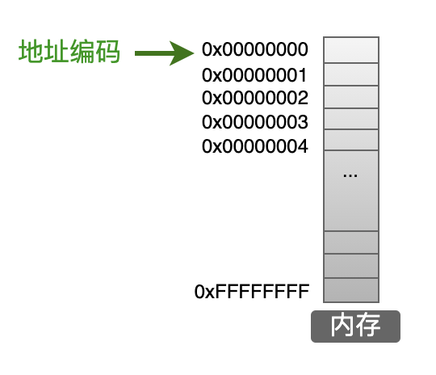

# 从指针来理解程序的执行

## 概述
+ **Q1** 地址，数组，指针？
+ **Q2** 万物皆指针？
+ **Q3** 一个程序里，指针到底是？
+ **总结** 

---

# Q1：地址，数组，指针
> address array pointer

----
1. **是什么？**

先来看看官方的定义

> c语言下的定义（[你们从来不看的](https://zh.cppreference.com/w/c))
<del>求求了，看一眼吧</del>


<hr>
+ 地址
    + 现实中的地址（[Wiki](https://zh.wikipedia.org/wiki/%E5%9C%B0%E5%9D%80)）
    + 计算机中地址（<red>非IP地址</red>）

+ 数组 （[array](https://zh.cppreference.com/w/c/language/array)）

+ 指针 （[pointer](https://zh.cppreference.com/w/c/language/pointer)）
    
<hr>

----
不那么官方的解释：
## 首先是地址
> 地址就是在<blue>空间（内存）</blue>上所占的一块位置的开头。<br>
地址只是地址头，是**页码编号，无法决定分配的内存。**<br>
（操作系统才是<del>国家</del>分配内存的那位大人)

### 地址和内存遥相呼应。<br>
地址标记了内存的某一个位置，像极了箭头。


----

## 然后是数组（数组大家应该很熟悉了。）<br>
> 数组无非是**一组相同类型的数据**的集合的类型

有趣但容易<red>误解</red>的例子：
```c
#include <stdio.h>

int main() {
    int x[2] = {114, 514};
    printf("x[0]:%d,x[1]:%d", 0 [x], 1 [x]);
    return 0;
}
```
**！！！这玩意能编译运行？**<br>
确实能，那问题来了，为什么能？<br>

----
## 终于是指针<br>
<br>
计算机的世界里，没有**黑魔法**<br>
那些看起来<red>“不正常”</red>的行为都是<blue>有原因的</blue><br>
<br>
这段代码可以解释为什么[implicit_conversionb](../code/implicit_conversionb.c)

> 看得很清楚，x[1]和1[x]的地址一样<br>

<br>
这说明他们俩<blue>站在同一个地方</blue>

站在同一个地方，自然是同一个数据。<br>
这是由于c语言的隐式转换导致的。<br>
这个地方的**x数组**被<blue>当作指针</blue>来处理了。<br>

----

## 所以来看看指针

> 别急，我们回到地址这边，利用地址来理解指针。

很简单的一块内存分布。<del>地址编号就是家庭地址（经纬度更恰当）</del>



----
一段简单的实例代码

```c
#include <stdio.h>
int main() {
    int a = 20;
    int *pa;
    pa = &a;
    printf("通过pa提供的地址，找到a=%d\n", *pa);
}
```

没什么特别的，指针也是变量，指针也需要内存来存放<br>
**指针就是存放地址编号的变量**<br>
> <blue>**思考**</blue>：指针只是编号的话，那为什么指针要声明类型？

----
## 指针可以**歪着指**

指针需要记录地址编号的开头，这我们很清楚。<br>
我们自然而然得想到，指针是否需要知道地址编号的结尾。<br>
如果指针知道它指向的变量有多大（内存）<br>
那它也就知道了结尾<del>（做个加法罢了）</del><br>

> 那什么叫指针可以歪着指？

还是看代码
```c
// 紧接上文
++pa;
printf("通过pa提供的地址，找到a下面的数据=%d\n", *pa);
```
<br>
现在我们就知道了，前面那个看起来有点奇怪的**黑魔法**是什么了<br>

---
# Q2：万物皆指针？
----
我们已经知道指针是什么了<br>
那么很显然，所有的变量，都可以被指针找到，然后**读取/修改**<br>
<red>哇，这太可怕了</red>
<del>会指针的C语言大佬恐怖如斯</del>

但是，细细想来，真的所有东西都可以被指针访问修改吗？
> 想想那个奇怪的代码，
<br>
我们在对x[2]赋值的时候，程序发生了什么？

----

## 操作系统貌似在吃干饭。 
<del><blue>像极了一些西方国家政府</blue></del><br>

我们貌似不能对**x[2]**赋值，操作系统拒绝了这个赋值？

> 真的是这样吗？ gdb 调试一下？

<br>
调试过后，我们可以看到，操作系统没有拒绝这个写入。<br>
只不过在**退出程序**的时候，它报错了。<br>

> <red> **\*\*\* stack smashing detected \*\*\*: terminated**<br>
[1]    xxxx IOT instruction (core dumped)  ./a.out</red> 

### <blue>有没有办法绕过这个报错？</blue>

----

当然是：提前终止程序就好了

> 是的，c语言就是这么简单易懂，不需要ptrace改写变量值，<br>
更不需要其他syscall指令

事实上在程序结尾加上**while(1);**也可以 做到类似的效果<br>
c语言没有限制我们对内存的一些<red>不合法</red>操作

> 这意味着什么？<del>操作系统，认真吃饭！</del>

我们可以做一些<red>**很危险**</red>但是有用的操作。

### <red>**指针真正的Power！**</red>

---

# Q3：一个程序里，指针到底是？
是否可以指向函数？代码片段？

----

## 指针的<red>Power！</red> <del>我的王之力！</del>

我要用指针使用！main函数！**<del>(狂)</del>**<br>

[神奇的代码](../code/callback_model.c)

> 通过函数指针，可以写了一个十分通用的**<blue>callback模型</blue>**<br>

这样就可以很方便地使用回调函数了


我们还能做什么？我们现在知道了，函数也可以用指针访问。<br>
我们接着就要问了，<red>能不能直接修改？</red><br>
到底能不能？<br>
**如能。**

----

## 我要修改函数！
> <red>这会不会很危险？</red>

[危险的代码](../code/dangerous.c)<br>

> [1] xxxx segmentation fault (core dumped)  ./a.out


**<red>啊，报错了！<del>我的王之力！</del>**</red>

为什么会报错？操作系统拒绝了这个赋值。<del>突然矜持</del><br>
这个时候应该意识到，**不是所有的内存都能读写(当然还有执行)**<br>
我们能不能知道，哪些是**可读**的？那些是**可写**的？
这是很自然的需求<br>

----
## 操作系统真没吃干饭

有需求就有<blue>代码（程序）</blue>

```shell
# Linux下使用pmap查看
pmap $pid 
```
我们可以看到一个进程分配的空间。<br>
以及它的地址啊，**读写权限。**<br>

> 都是操作系统提供的帮助。

当然，Linux下你是可以<red>直接看到进程文件的</red><br>
> 万物皆文件（虚拟化，持久化）

----
## 我们也许需要更多信息

```shell
# 直接看maps
cat /proc/$pid/maps
```
是的，我们可以看到进程的内存是如何分布的。

> <blue>指针是内存的指针</blue>

有没有方法<red>直接修改</red>不可写的内存区域？<br>
好了，先别想这么多。因为，这都是很危险的操作。<br>
**一不小心，程序就boom了**<br>
所以谨慎地使用指针吧。<br>
现在介绍，最简单的，指针开辟空间方法。<blue>也是最常用的</blue><br>

----
## malloc 和 free

看代码（[安全的代码](../code/save.c)）

> 思考：我们能不能用数组开辟？<br>
这个操作是不是真的安全，有没有隐患？


<red>如果在**free(ptr)**之前程序终止了。</red><br>


会怎么样？<br>
ptr开辟的空间怎么办？<br>
如果有个程序反复开辟空间，不free，我们的电脑会怎么样？<br>
是的，会**<red>boom！</red>**

Boom的代码（[防止超过2GB](../code/boom.c)）

指针差不多就这么多内容（

---

# 总结

奇怪的知识增加了

<!--  -->


----

## Q1 地址，数组，指针？
1. 地址在计算机中就类似书的页码，行列。
2. 数组是一组同类型的数据的集合的变量类型。
3. 指针是存储地址的变量类型。

 **<red>数组不是指针</red>**<br>
 就像 int 不是 float 一样
 <br>
 <br>
> 所以指针就是变量类型罢了。

----

## Q2 万物皆指针？
计算机里，万物都需要内存来存储，<br>
指针能不能访问那块内存得看操作系统。


<del>指针：我成跪着要饭的了。</del>

<br>
> **<blue>还得看操作系统的脸色。</blue>**

----

## Q3 一个程序里，指针到底是？

指针只不过是，通过寻址，然后**间接**进行读写执行的一种手段。<br>

<blue>至于指针的指针的指针的指针。。。(此处省略)</blue><br>
<br>
1024级指针：[当然这是没必要的](../code/n_level_pointer.c)

<br>

> <red>使用指针时要谨慎。</red>

<br>

<blue>最后，希望各位能善待指针。<red><del>（被指针善待）</del></red><br><br>**以上**</blue>


