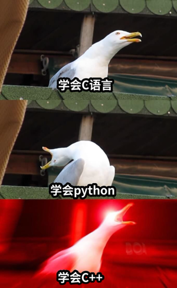

# 编程语言的使用

> 语言只是工具，能解决问题的工具就是好工具

----

## 概述

- **Q1** shell的使用
- **Q2** C->C++->python
- **Q3** 什么时候用什么语言


<!--  -->

---

# 1：shell的使用？

----

> 为什么要先说shell?

**shell** 是早些年代<del>（当然现在也用</del> 的一款语言，
它会从<blue>命令行</blue>读取命令然后执行。
使用Linux少不了shell的陪伴，在介绍其他语言前，自然得先说一下陪伴我们最多的shell。


----

shell 的进化历史

> sh -> bash -> zsh/fish （个人推荐使用新手fish）

[fish官网](https://fishshell.com/)


----

当然为了解shell的历史，还是得看看bash

[点击查看bash](https://manpages.debian.org/unstable/manpages-zh/bash.1.zh_CN.html)

> 也许是更好的文档(但全英文)

- 命令行输入

```shell
man sh
```

- 使用sh意味着我们无时无刻不在编程(

```shell
# ex1:我想知道某个程序运行的时间?
time <那个程序>
# ex2:我想关机?
poweroff
#  我还想...
```

----

## shell的调用控制和运算

+ <blue>调用</blue>：使用存在的部分
    - 变量
    - 函数
    - 可执行文件：通常为二进制文件（ELF）或脚本

+ <blue>控制</blue>：主要包括循环和选择

+ <blue>运算</blue>：shell中最智能的地方，主要在运算符方面

> 这三者构成了shell这门语言最基本的部分

----

### shell的调用

主要讲一下<blue>可执行文件</blue>，暂时<red>避开变量和函数</red>

+ <blue>调用</blue><br>

    - <blue>直接执行的命令</blue><br>
        shell会在PATH路径下一个一个找过去，也就是说几乎所有的命令都可以在PATH下找到，
        也可以把自己编译得到的命令放到某个PATH下。

    - <blue>指定路径执行的命令</blue><br>
        shell会在PATH路径下一个一个找过去，也就是说几乎所有的命令都可以在PATH下找到，
        shell也可以通过在二进制文件或脚本的绝对路径或相对路径前加.来执行该文件命令<br>

> <blue>ps：cd命令是对系统调用的封装，不是PATH下的二进制文件</blue>

----
### shell的调用例子

```shell
# 查看所有的PATH
echo $PATH
# 查看ls命令所在位置
which ls 
# 执行某个可执行文件
./<可执行文件路径>
#变量 ps：等于号前后不能为空格
STR="Hello World"
# 函数
sayHello(){echo "$STR"}; sayHello;
```
> PATH其实是shell的变量
----
### shell的控制

+ 选择
    - if
    - if else
    - if elif else
+ 循环 
    - for
    - while
    - do while

> 老生常谈，放个链接自己看

[菜鸟教程](https://www.runoob.com/linux/linux-shell-process-control.html)

----
### shell的运算
shell 的运算很独特，除了加减乘除且或等<br>
还有一类比较独特的符号---<blue>重定向符</blue>

| 符号   | 功能 |
| :----- | :--: |
|  >  |  	将命令输出写入到文件或设备（例如打印机）中，而不是写在命令提示符窗口中。  |
|  <  |  	从文件中而不是从键盘中读入命令输入。  |
|  >> |  将命令输出添加到文件末尾而不删除文件中的信息。  |
|  >& |  	将一个句柄的输出写入到另一个句柄的输入中。  |
|  <& |  	从一个句柄读取输入并将其写入到另一个句柄输出中。  |
|  \| |  	从一个命令中读取输出并将其写入另一个命令的输入中。也称作管道。  |

----
### shell的运算例子

```shell
# 把当前目录下的内容写入 tmp.txt文件
tree > tmp.txt
# 等同于cat tmp.txt
cat < tmp.txt
# 在tmp.txt追加日期
date >> tmp.txt
# 在tmp.txt追加日期
date >> tmp.txt
# 查看当前目录下的cpp文件
ls | grep *.cpp
```
> 通过复合使用这些符号，利用<blue>简单</blue>的工具完成<red>复杂</red>的任务

----
## 更现代的shell命令

- 试试fish

```shell
fish
fish_config
```

<del>然后自己玩</del>

- 也许不只是shell

```shell
# 类似shell的方式使用python3
python3
# 对python而言。也许就像fish一样，有更好的交互方式。
# 安装ipython （少不了清华源）
pip3 install ipython -i https://pypi.tuna.tsinghua.edu.cn/simple
ipython
```

> 也许ipython可以让你重新认识python

---

# 2：C->C++->python



----

## C语言适合做什么?

> 接近底层的低抽象程序设计。

个人观点：用C语言写数学题完全是<red>浪费时间</red>。<br>
C语言做底层封装更合适，比如

+ <blue>封装计算</blue>
+ <blue>内存分配器</blue>
+ <blue>线程池</blue>

简单来说，C语言的模型接近**状态机**，是控制状态的过程。

----
### 熟悉而陌生的C语言

C语言里有很多你们可能<red>手动实现</red>过，但其实是<blue>标准库</blue>有的东西<br>
比如：

- 字符串 [点击查看](https://zh.cppreference.com/w/c/string)
- 数值相关 [点击查看](https://zh.cppreference.com/w/c/numeric)

还有些你们<red>不喜欢的东西</red>：

- 排序 [点击查看](https://zh.cppreference.com/w/c/algorithm/qsort)
```c
void qsort( void *ptr, size_t count, size_t size,
            int (*comp)(const void *, const void *) );
```
> 你们肯定<red>不想用这样复杂</red>的api，但标准库提供了

----
### 现代的C语言

还有些偏现代的特性：

- 泛型数学 [点击查看](https://zh.cppreference.com/w/c/numeric/tgmath)
- 并发支持 [点击查看](https://zh.cppreference.com/w/c/thread)

> 你们<red>不会自己去实现的东西</red>，C标准库也提供了

说起现代，不可避免地要说到C++，它是一门现代的语言<br>
很多人不喜欢C++，觉得它破坏了C的<blue>小而美</blue><br>
但也许我们应该<blue>辩证地看待C++</blue>，不过是一门语言，试试又何妨。<br>

----

## C++适合做什么?

> 高性能计算和高抽象设计

C++ 的抽象能力很强，有多种编程范式，面向对象，元编程，函数式编程。<br>

+ 最常用的面向对象，模型接近<blue>行为树</blue>。
+ 元编程，即---编写<blue>生成代码的代码</blue>。
+ 函数式编程，一切抽象为<blue>表达式求值</blue>。

C++适合设计，但它最大的毛病也在于此，限制太少，<br>
容易写出满是bug的代码，所以**不适合**新手。<br>
<del>ps:已经会C语言就不是新手了</del><br>

----

## C++，噩梦的开始

### 也许C++没有那么难

> C++ 很难学这个概念，似乎在人们心中根深蒂固，但真的是这样吗？

回到前面的C语言，C语言的排序很复杂， 正常人不会想用那种api

- 排序 [点击查看](https://zh.cppreference.com/w/cpp/algorithm/sort)

```c++
# s是stl容器
std::sort(s.begin(), s.end());
# customLess 自定义的比较方式
std::sort(s.begin(), s.end(), customLess);
```
> 比C清爽很多，不是吗？C++<red>并没有想象中那么难</red>

----
### C++也<blue>不总是那么简单</blue>

- 元编程 [点击查看](https://zh.cppreference.com/w/cpp/meta)
- 迭代器 [点击查看](https://zh.cppreference.com/w/cpp/iterator)
- 并发支持 [点击查看](https://zh.cppreference.com/w/cpp/thread)
- 内存管理 [点击查看](https://zh.cppreference.com/w/cpp/memory)
- 通用工具 [点击查看](https://zh.cppreference.com/w/cpp/utility#.E9.80.9A.E7.94.A8.E5.B7.A5.E5.85.B7)

> 比C简单的api背后，是海量的代码在支持，所以说C++难

----
### C++很复杂，但并非困难

- 零开销原则 [点击查看](https://zh.cppreference.com/w/cpp/language/Zero-overhead_principle)

> 所以你<blue>几乎不用担心</blue>，C++那么复杂，学不完怎么办

```c++
# 一切不过是对底层的抽象和封装
std::cout << "Hello World\n";
```

那么，C++作为高性能的代表，至今仍有一个问题困扰各C++程序员<br>

### <red>包管理</red>

提到包管理，那一定绕不开<blue>python</blue>

----

## python适合做什么?

> 简单小巧的任务

<blue>一句话能说清楚需求的任务</blue>，python再合适不过。<br>
比如计算。

```shell
>  ipython
In [1]: from sympy import *
In [2]: x = symbols("x")
In [3]: y = (5**5)*atan(x)
In [4]: y
Out[4]: 3125*atan(x)
In [5]: y.diff()
Out[5]: 3125/(x**2 + 1)
In [6]: y.integrate()
Out[6]: 3125*x*atan(x) - 3125*log(x**2 + 1)/2
```

----
## python的包管理

```shell
pip3 install xxx
```
> <blue>简单友好</blue>的工具总是受到大家的青睐

python很适合做些小东西，同样地

> 比C++简单的api背后，是海量的代码在支持（但并非官方提供的）

所以各行各业都比较喜欢使用python来开发<br>
但python也有很难绕开的毛病：<red>慢</red><br>

所以python虽然在某些时候很好用，但偶尔<br>
程序员宁愿自己用C++实现相同的功能，也不愿使用python<br>
大材小用地讲，python<red>至少是个很厉害的计算器</red><br>

---

# 3：什么时候用什么语言
> 不要有语言歧视，每种语言都有适合自己的领域


----

C++可以应付大部分场景<br>

+ 但是如果涉及较多**系统调用**我会先考虑C语言<br>
+ 如果要做稍微**复杂一点的计算**，我会考虑python<br>
+ 如果要**日常使用**的命令我会选择shell（当然这个也算不得选择<br>

> 接下来来点干货（推荐


----

+ 通用
    - [ChatGPT](https://chat.openai.com/) 
    - [工具箱](https://github.com/PKUFlyingPig/cs-self-learning/blob/master/docs/%E5%BF%85%E5%AD%A6%E5%B7%A5%E5%85%B7/tools.md)
    - [解答](https://stackoverflow.com/)
    - [编程书籍推荐](https://github.com/EbookFoundation/free-programming-books/blob/main/books/free-programming-books-zh.md)
    - [书籍下载](https://annas-archive.org)
    - [在线编译](https://godbolt.org/)
    - [算法](https://www.hello-algo.com/)
    - [代码快速查询手册](https://quickref.cn/)

----

+ shell
    - [modern unix](https://github.com/ibraheemdev/modern-unix)

+ c++
    - [c++手册](https://zh.cppreference.com/w/%E9%A6%96%E9%A1%B5)
    - [谷歌开源风格指南](https://zh-google-styleguide.readthedocs.io/en/latest/google-cpp-styleguide/)
    - [xmake](https://xmake.io/#/)
    - [c++行为树库](https://github.com/BehaviorTree/BehaviorTree.CPP)
    - [配套的工具](https://www.behaviortree.dev/groot/)

+ python
    - [jupyter](https://jupyter.org/)
    - [matplotlib](https://matplotlib.org/)
    - [sympy](https://www.sympy.org/zh/)
    - [谷歌免费机器学习训练](https://colab.research.google.com/?pli=1#scrollTo=Nma_JWh-W-IF)

----


> 最后希望大家使用更现代的工具，更好地编程（解决问题）


