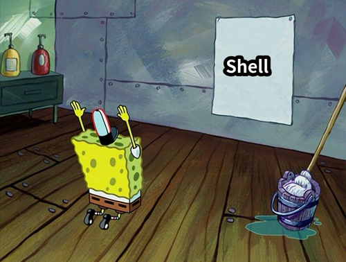

# 编程语言的使用

> 语言只是工具，能解决问题的工具就是好工具

----

## 概述

- **Q1** shell的使用
- **Q2** C->C++->python
- **Q3** 什么时候用什么语言


<!--  -->

---

# 1：shell的使用？

----

> 为什么要先说shell?

**shell** 是早些年代<del>（当然现在也用</del> 的一款语言，
它会从<blue>命令行</blue>读取命令然后执行。
使用Linux少不了shell的陪伴，在介绍其他语言前，自然得先说一下陪伴我们最多的shell。



----

shell 的进化历史

> sh -> bash -> zsh/fish （个人推荐使用新手fish）

[fish官网](https://fishshell.com/)


----

当然为了解shell的历史，还是得看看bash

[点击查看bash](https://manpages.debian.org/unstable/manpages-zh/bash.1.zh_CN.html)

> 也许是更好的文档(但全英文)

- 命令行输入

```shell
man sh
```

- 使用sh意味着我们无时无刻不在编程(

```shell
# ex1:我想知道某个程序运行的时间?
time <那个程序>
# ex2:我想关机?
poweroff
#  我还想...
```

----

- 试试fish

```shell
fish
fish_config
```

<del>然后自己玩</del>

- 也许不只是shell

```shell
# 类似shell的方式使用python3
python3
# 对python而言。也许就像fish一样，有更好的交互方式。
# 安装ipython （少不了清华源）
pip3 install ipython -i https://pypi.tuna.tsinghua.edu.cn/simple
ipython
```

> 也许ipython可以让你重新认识python

---

# 2：C->C++->python


----

## C适合做什么?

> 接近底层的低抽象程序设计。

个人观点：用C语言写数学题完全是<red>浪费时间</red>。<br>
C语言做底层封装更合适，比如

+ <blue>封装大数</blue>
+ <blue>内存分配器</blue>
+ <blue>线程池</blue>

简单来说，C语言的模型接近**状态机**，是控制状态的过程。

----

## C++适合做什么?

> 高性能计算和高抽象设计

C++ 的抽象能力很强，有多种编程范式，面向对象，元编程，函数式编程。<br>

+ 最常用的面向对象，模型接近<blue>行为树</blue>。
+ 元编程，即---编写<blue>生成代码的代码</blue>。
+ 函数式编程，一切抽象为<blue>表达式求值</blue>。

C++适合设计，但它最大的毛病也在于此，限制太少，<br>
容易写出满是bug的代码，所以**不适合**新手。<br>
<del>ps:已经会C语言就不是新手了</del><br>

----

## python适合做什么?

> 简单小巧的任务

<blue>一句话能说清楚需求的任务</blue>，python再合适不过。<br>
比如计算。

```shell
>  ipython
In [1]: from sympy import *
In [2]: x = symbols("x")
In [3]: y = (5**5)*atan(x)
In [4]: y
Out[4]: 3125*atan(x)
In [5]: y.diff()
Out[5]: 3125/(x**2 + 1)
In [6]: y.integrate()
Out[6]: 3125*x*atan(x) - 3125*log(x**2 + 1)/2
```

---

# 3：什么时候用什么语言
> 不要有语言歧视，每种语言都有适合自己的领域


----

C++可以应付大部分场景<br>

+ 但是如果涉及较多**系统调用**我会先考虑C语言<br>
+ 如果要做稍微**复杂一点的计算**，我会考虑python<br>
+ 如果要**日常使用**的命令我会选择shell（当然这个也算不得选择<br>

> 接下来来点干货（推荐


----

+ 通用
    - [ChatGPT](https://chat.openai.com/) 
    - [工具箱](https://github.com/PKUFlyingPig/cs-self-learning/blob/master/docs/%E5%BF%85%E5%AD%A6%E5%B7%A5%E5%85%B7/tools.md)
    - [解答](https://stackoverflow.com/)
    - [编程书籍推荐](https://github.com/EbookFoundation/free-programming-books/blob/main/books/free-programming-books-zh.md)
    - [书籍下载](https://annas-archive.org)
    - [在线编译](https://godbolt.org/)
    - [算法](https://www.hello-algo.com/)
    - [代码快速查询手册](https://quickref.cn/)

----

+ shell
    - [modern unix](https://github.com/ibraheemdev/modern-unix)

+ c++
    - [c++手册](https://zh.cppreference.com/w/%E9%A6%96%E9%A1%B5)
    - [谷歌开源风格指南](https://zh-google-styleguide.readthedocs.io/en/latest/google-cpp-styleguide/)
    - [xmake](https://xmake.io/#/)
    - [c++行为树库](https://github.com/BehaviorTree/BehaviorTree.CPP)
    - [配套的工具](https://www.behaviortree.dev/groot/)

+ python
    - [jupyter](https://jupyter.org/)
    - [matplotlib](https://matplotlib.org/)
    - [sympy](https://www.sympy.org/zh/)
    - [谷歌免费机器学习训练](https://colab.research.google.com/?pli=1#scrollTo=Nma_JWh-W-IF)

----


> 最后希望大家使用更现代的工具，更好地编程（解决问题）


