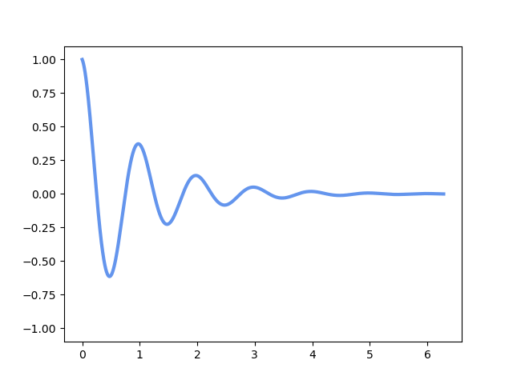

{
    "author": {
        "name": "作者：谭嘉淳",
        "url": "http://luoyebai.cn:7890"
    },
    "departments": [
        {
            "name": "Github",
            "url": "https://github.com/",
            "img_url": "./img/github-log.jpg"
        },
        {
            "name": "CS-Self-Learning",
            "url": "https://csdiy.wiki/",
            "img_url": "./img/cs-self-learning.jpg"
        },
        {
            "name":"Awesome Lists",
            "url":"https://github.com/topics/awesome",
            "img_url": "./img/awesome-logo.svg"
        }
    ]
}
+++++

# **编程概述**

++++

## 概述 ***（Overview）***
+ **Q1.** 为何编程？***（Why）***
+ **Q2.** 何为编程？***（What）***
+ **Q3.** 如何编程？***（How）***
+ **Q4.** 形如编程？***（Like）***

---

# **Q1.** 为何编程？***（Why）***

> 首先考虑第一个重要的问题：**为何**[***学习(点击查看)***](https://zh.wikipedia.org/wiki/%E5%AD%A6%E4%B9%A0)？

----

## **灵魂拷问**：为什么要学习***xxx（Anything）***
可能是萦绕在所有人头顶的一个<red>疑问</red>：

- 为什么要学习？***（Why study?）***
    - 比如：
        - 为什么要学[***工具(点击查看)***](https://zh.wikipedia.org/wiki/%E6%95%B0%E5%AD%A6)
        - 为什么要学[***数学（希腊语：μαθηματικά）(点击查看)***](https://zh.wikipedia.org/wiki/%E6%95%B0%E5%AD%A6)
        - 为什么要学[***语言（英语：language，词源为拉丁语：lingua，意为“舌”）(点击查看)***](https://zh.wikipedia.org/wiki/%E8%AA%9E%E8%A8%80)
- 只是为了***学会xxx（master somthing）？***
--
- 是，但不仅仅是这样***（Yes,but not only）***
    - 不仅是学会
    - 更是[创新***（英语：Innovation，源自拉丁语 innovare，“更新”）(点击查看)***](https://zh.wikipedia.org/wiki/%E5%89%B5%E6%96%B0)
----
## **学习工具**的重要性

工具能帮助人类

- 能帮助人类做到原先做不到的事情 
- 能帮助人类更轻松地做到某些事情
- 能帮助人类“不需要做某些事情”
    - [自动机***（英语：Automaton，又称自动机器、自动机械）(点击查看)***](https://zh.wikipedia.org/wiki/%E8%87%AA%E5%8B%95%E6%A9%9F)
    - [电子计算机***（英语：Computer）(点击查看)***](https://zh.wikipedia.org/wiki/%E7%94%B5%E5%AD%90%E8%AE%A1%E7%AE%97%E6%9C%BA)
    - [ChatGPT***（英语全称：Chat Generative Pre-trained Transformer）(点击查看)***](https://zh.wikipedia.org/wiki/ChatGPT)
- **数学/语言**也是工具

> 君子性非异也，善假于物也———[荀子]《劝学》

----
## **学习思想**的重要性

除了学习工具，还有思想

- 学习某种[理论***（英语：theory）(点击查看)***](https://zh.wikipedia.org/wiki/%E7%90%86%E8%AB%96)

----

## 来看看历史

- [编程语言历史(点击查看)](https://zh.wikipedia.org/zh-cn/%E7%A8%8B%E5%BC%8F%E8%AA%9E%E8%A8%80%E6%AD%B7%E5%8F%B2)
- [图灵机***（英语：Turing machine）(点击查看)***](https://zh.wikipedia.org/wiki/%E5%9B%BE%E7%81%B5%E6%9C%BA)
- [电子计算机***（英语：Computer）(点击查看)***](https://zh.wikipedia.org/wiki/%E7%94%B5%E5%AD%90%E8%AE%A1%E7%AE%97%E6%9C%BA)

> 第一个编程语言的出现早于现代的计算机的诞生。首先，这种语言是种[代码(点击查看)](https://zh.wikipedia.org/wiki/%E4%BB%A3%E7%A0%81)。 

----

## 重点讲讲图灵机

- 一台图灵机是一个七元有序组$（Q,\Sigma,\Gamma,\delta,q_0,q_{accept},q_{reject}）$都是[有限集合(点击查看)](https://zh.wikipedia.org/wiki/%E6%9C%89%E9%99%90%E9%9B%86%E5%90%88)，且满足：

---

# **Q4.** 形如编程？***（Like）***

--
***Math like PL(Tools like PL)*** 
***Machine like PL(Automaton like PL)*** 
***The World like PL(Everything like PL)*** 
