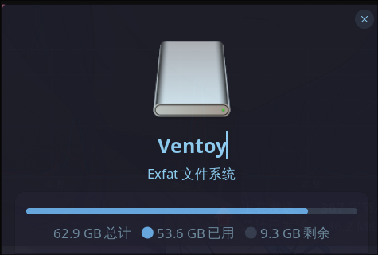

# 初识linux

## 概述 

+ **Q1** 什么是linux？
+ **Q2** 为什么要使用linux？
+ **Q3** linux如何<del>启动</del>使用？

---

# Q1：什么是linux？

----

你在此处不要走动，我去翻翻维基百科 
[点击查看linux](https://zh.wikipedia.org/wiki/Linux)

所以，什么是linux？
<del>其实就是一堆c代码(</del> 
其实就是一堆很🐮的c代码写出来的操作系统内核 
 
而且你可以在github上阅读linux源代码 
[放心大胆地读源码吧！<del>反正看不懂</del>](https://github.com/torvalds/linux) 
 
然后，各大厂商在Linux内核代码的基础上，开发出了一些操作系统。

---

# Q2 为什么要使用linux？

说到操作系统，那就不得不和Windows对比一下了。 
为神魔药用Linux而不是Windows呢？

----

## Windows VS Linux

----

> ### 第一回合！

Windows **要钱** <del>虽然这难不倒中国用户</del> 
Linux **免费！自由！**double free 
Linux 这波，遥遥领先。

----

> ### 第二回合！

Windows 不如 Linux 流畅、稳定、安全 

Linux对开发者十分友好，而且便捷 

ex: 大部分Linux发行版自带python

Linux 继续领先！ 

----

> ### 让我们直接进入第三回合！

让我们看看Windows怎么说 
Windows: 我对英伟达支持友好。 
Linus(Linux它爹):**so nvidia fxxk you!**

----

### 好好，让我暂时先忽略刚才的图片

总而言之，Linux对程序员来说，是很不错的一个系统。 
而说到 Linux 各大发行版，作为 Arch 神教的一员。 
 
给各位推荐的发行版自然是----**Ubuntu 22.04** 
<del>(初学者用什么arch，真的是)</del> 
 
等学得差不多了，也可以尝试一下其他的发行版。 
[测试一下你最适合哪个发行版](https://distrochooser.de/zh-hans)
  
终于还是到了这个时候吗？ 
是时候了，Linux，启动！

---

# Q3:linux如何<del>启动</del>使用？

以Ubuntu22.04为例，尝试安装

----

## 启动盘制作

先准备好一个16G左右的U盘，制作成Ventoy。 
U盘会被格式化，请提前做好文件备份。 
[这里是教程](https://www.ventoy.net/cn/doc_start.html)
 

制作好的U盘名字会变成Ventoy

----

## Ubuntu镜像下载

[这是ubuntu22.04.3的ISO镜像](https://releases.ubuntu.com/22.04/ubuntu-22.04.3-desktop-amd64.iso) 
把ubuntu的ISO镜像拖到制作好的U盘上即可。 
查询自己电脑的Bios启动按钮，然后在开机的时候多次按，通常为F10,F2之类的。 
接下来插上U盘，尝试通过U盘来启动ubuntu安装程序。 
大概长这样：
[启动界面](https://cn.linux-console.net/common-images/use-ventoy/Ventoy-boot-screen.png)
然后按照指引一步一步走就好了。

----

## 注意事项

+ [解除磁盘锁](https://zhuanlan.zhihu.com/p/60704389)
+ [初始分配空间不够，扩磁盘空间](https://zhuanlan.zhihu.com/p/146554549)
+ [timeshift备份，防止系统崩溃，环境重配](https://zhuanlan.zhihu.com/p/94105263)
+ [安装显卡驱动！**慎重**，一定要做好备份](https://zhuanlan.zhihu.com/p/393152883)
