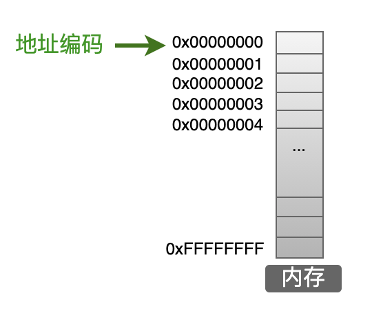
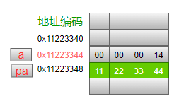

{
    "author": {
        "name": "作者：谭嘉淳",
        "url": "http://luoyebai.cn:7890"
    },
    "departments": [
    ]
}
+++++
# [🏠](../../../dist/index.html#/1)从指针来理解程序的执行

----

## 概述
+ **Q1** 地址，数组，指针？
+ **Q2** 万物皆指针？
+ **Q3** 一个程序里，指针到底是？
+ **总结** 

---

# Q1：地址，数组，指针
> address array pointer

----
## **这三个玩意是什么？**


<hr>

- 先来看看官方的定义<br>
+ 地址
    + 现实中的地址（[Wiki](https://zh.wikipedia.org/wiki/%E5%9C%B0%E5%9D%80)）
    + 计算机中地址（<red>非IP地址</red>）

+ 数组 （[array](https://zh.cppreference.com/w/c/language/array)）

+ 指针 （[pointer](https://zh.cppreference.com/w/c/language/pointer)）

<del>求求了，看一眼吧</del>

> ps:c语言的参考文档（[你们从来不看的](https://zh.cppreference.com/w/c))<br>
[iso也可(点击查看)](https://www.iso.org/home.html)

- 不那么官方的解释
    
<hr>

----
## 首先是地址

- 地址就是在<blue>空间-[内存(点击查看)](https://zh.wikipedia.org/wiki/%E9%9A%8F%E6%9C%BA%E5%AD%98%E5%8F%96%E5%AD%98%E5%82%A8%E5%99%A8)
</blue>上所占的一块位置的开头。<br>
- 地址只是地址头，是**页码编号，并不知道有多少页(不知道内存块大小)。** <del>（操作系统才是分配内存的那位大人)</del>
- 这里还涉及到[虚拟内存(点击查看)](https://zh.wikipedia.org/wiki/%E8%99%9A%E6%8B%9F%E5%86%85%E5%AD%98)的知识

- 地址和内存遥相呼应。<br>
    - 地址标记了内存的某一个位置，像极了箭头。


----

## 然后是数组（数组大家应该很熟悉了。）<br>

- 数组无非是**相同类型数据的集合**
- 有趣但容易<red>误解</red>的例子：
```c
#include <stdio.h>

int main() {
    int x[2] = {114, 514};
    printf("x[0]:%d,x[1]:%d", 0 [x], 1 [x]);
    return 0;
}
```
- **！！！这玩意能编译运行？**<br>
    - 确实能，那问题来了
    - <blue>为什么能？</blue>

----
## 终于是指针<br>
- 计算机的世界里，没有**黑魔法**<br>
- 那些看起来<red>“不正常”</red>的行为都是<blue>有原因的</blue><br>
- 这段代码可以一定程度上解释原因<br>[implicit_conversionb](../code/implicit_conversionb.c)
- 看得很清楚，x[1]和1[x]的地址一样<br>
    - 这说明他们俩<blue>数据在同一个地方</blue>
        - 站在同一个地方，自然是同一个数据。<br>
    - 这是由于c语言的隐式转换导致的。<br>
        - 这个地方的**x数组**被<blue>当作指针</blue>来处理了。<br>

> ps:[函数签名(点击查看)](https://zh.wikipedia.org/wiki/%E7%B1%BB%E5%9E%8B%E7%AD%BE%E5%90%8D)
参数为int时，传入float/double变量也行就是因为有隐式转换

----

## 所以来看看指针

- 别急，我们回到地址这边，利用地址来理解指针。
- 很简单的一块内存分布。<del>地址编号就是家庭地址（经纬度更恰当）</del>



----
- 一段简单的实例代码

```c
#include <stdio.h>
int main() {
    int a = 20;
    int *pa;
    pa = &a;
    printf("通过pa提供的地址，找到a=%d\n", *pa);
}
```


- 没什么特别的，指针也是变量，指针也需要内存来存放<br>
- **指针就是数据为地址编号的变量**<br>
> <blue>**思考**</blue>：指针只是编号的话，那为什么指针要声明类型？

----
## 指针可以**歪着指**

- 指针需要记录地址编号的开头，这我们很清楚。
- 我们自然而然得想到，指针是否需要知道地址编号的结尾。<br>
    - 如果指针知道它指向的变量有多大（内存）<br>
    - 那它也就知道了结尾<del>（做个加法罢了）</del><br>

> 那什么叫指针可以歪着指？

- 还是看代码
```c
// 紧接上文
++pa;
printf("通过pa提供的地址，找到a下面的数据=%d\n", *pa);
```

> 现在就知道了，前面那个看起来有点奇怪的**黑魔法**是什么了<br>

---
# Q2：万物皆指针？
----
## 指针万能吗？

- 我们已经知道指针是什么了
- 那么很显然，所有的变量，都可以被指针找到，然后**读取/修改**<br>
<red>哇，这太可怕了</red>
<del>会指针的C语言大佬恐怖如斯</del>

    - 但是，细细想来，真的所有东西都可以被指针访问修改吗？
> 想想那个奇怪的代码，
<br>
我们在对x[2]赋值的时候，程序发生了什么？

----

## 操作系统貌似在吃干饭。 
<del><blue>像极了某些西方国家政府</blue></del><br>

- 我们貌似不能对**x[2]**赋值，操作系统拒绝了这个赋值？
- 真的是这样吗？ gdb 调试一下？

- 调试过后，我们可以看到，操作系统没有拒绝这个写入。<br>
只不过在**退出程序**的时候，它报错了。<br>

> <red> **\*\*\* stack smashing detected \*\*\*: terminated**<br>
[1]    xxxx IOT instruction (core dumped)  ./a.out</red> 


----

## <blue>有没有办法绕过这个报错？</blue>

- 当然有：提前终止程序就好了

- 是的，c语言就是这么简单易懂，不需要ptrace改写变量值，<br>
更不需要其他syscall指令

- 事实上在程序结尾加上**while(1);**也可以 做到类似的效果<br>
c语言没有限制我们对内存的一些<red>不合法</red>操作

- 这意味着什么？<del>操作系统，认真吃饭！</del>
    - 我们可以做一些<red>**很危险**</red>
        - 但是有用的操作。

- <red>**指针真正的Power！**</red>

> ps:这里的危险并非[ub(点击查看)](https://zh.wikipedia.org/wiki/%E6%9C%AA%E5%AE%9A%E4%B9%89%E8%A1%8C%E4%B8%BA)操作


---

# Q3：一个程序里，指针到底是？
是否可以指向函数？代码片段？

----

## 指针的<red>Power！</red> <del>我的王之力！</del>

- 我要用指针使用！main函数！**<del>(狂)</del>**<br>
[神奇的代码](../code/callback_model.c)

> 通过函数指针，可以写了一个十分通用的**<blue>callback模型</blue>**<br>
<red>ps:事实上最好不要调用[main函数(点击查看)](https://zh.cppreference.com/w/cpp/language/main_function),该代码用到了编译器拓展</red>

- 这样就可以很方便地使用回调函数了


- 我们现在知道了，函数也可以用指针访问。<br>
    - 我们接着就要问了，<red>能不能直接修改？</red><br>
    到底能不能？<br>
        - **如能。**

----

## 我要修改函数！

- <red>这会不会很危险？</red><br>
[危险的代码](../code/dangerous.c)

> [1] xxxx segmentation fault (core dumped)  ./a.out


- **<red>啊，报错了！<del>我的王之力！</del>**</red>

- 为什么会报错？操作系统拒绝了这个赋值。<del>突然矜持</del><br>
    - **不是所有的内存都能读写(执行)？**<br>
- 如果是这样，那我们能不能知道，哪些是**可读**的？那些是**可写**的？
    - 这是很自然的需求<br>

----
## 操作系统真没吃干饭

- 有需求就有<blue>代码（程序）</blue>

```shell
# Linux下使用pmap查看
pmap $pid 
```
- 我们可以看到一个进程分配的空间。
    - 即它的地址
        - 自然也有：**读写权限。**
- 都是操作系统提供的帮助。
    - 当然，Linux下你是可以<red>直接看到进程文件的</red><br>

> 所谓万物皆文件

----
## 我们也许需要更多信息

```shell
# 直接看maps
cat /proc/$pid/maps
```
- 是的，我们可以看到进程的内存是如何分布的。

> <blue>指针是内存的指针</blue>

- 有没有方法<red>直接修改</red>不可写的内存区域？<br>
    - 好了，先别想这么多。因为，这都是很危险的操作。<br>
        - **一不小心，程序就boom了**<br>
- 所以谨慎地使用指针吧。<br>

- 现在介绍，最简单的，指针开辟空间方法。<blue>也是最常用的</blue><br>

----
## malloc 和 free

- 看代码（[安全的代码](../code/save.c)）

> 思考：这个操作是不是真的安全，有没有隐患？

- <red>如果在**free(ptr)**之前程序终止了。</red><br>
    - 会怎么样？<br>


- ptr开辟的空间怎么办？<br>
    - 如果有个程序反复开辟空间，不free，我们的电脑会怎么样？<br>
        - 是的，会**<red>boom！</red>**

- Boom的代码（[需要sudo的Boom](../code/boom.c)）<br>
    - 指针差不多就这么多内容（

---

# 总结

奇怪的知识增加了

<!--  -->


----

## Q1 地址，数组，指针？
1. 地址在计算机中就类似书的页码，行列。
2. 数组是一组同类型的数据的集合的变量类型。
3. 指针是存储地址的变量类型。

 - **<red>数组不是指针</red>**<br>
 > 就像 int 不是 float 一样
 <br>
 <br>
> 所以指针就是变量类型罢了。

----

## Q2 万物皆指针？
- 计算机里，万物都需要内存来存储，<br>
- 指针能不能访问那块内存得看操作系统。<br>
<del>指针：我成跪着要饭的了。</del>


<br>
> **<blue>还得看操作系统的脸色。</blue>**

----

## Q3 一个程序里，指针到底是？

- 指针只不过是，通过寻址，然后**间接**进行读写执行的一种手段。<br>
<blue>至于指针的指针的指针的指针。。。(此处省略)</blue><br>
- 1024级指针：[当然这是没必要的(点击查看代码)](../code/n_level_pointer.c)

- 拓展:[为什么指针是个糟糕的语言特性(点击查看)](https://github.com/FrankHB/pl-docs/blob/master/zh-CN/why-is-pointer-awful.md)
    - <red>使用指针时要谨慎。</red><br>
        - cpp中大多用[智能指针(点击查看)](https://zh.cppreference.com/w/cpp/memory)管理
- <blue>最后，希望各位能善待指针。<red><del>（被指针善待）</del></red>
  
> <blue>**以上**</blue>


