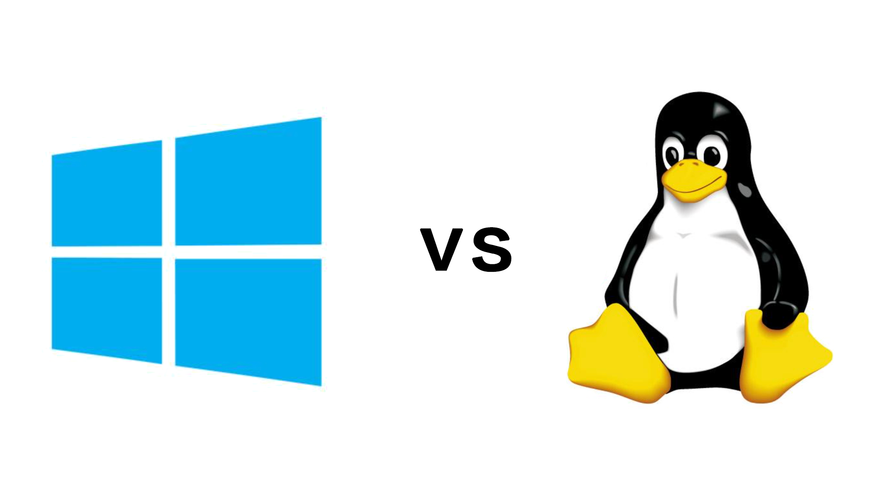

{
    "author": {
        "name": "作者：谭嘉淳",
        "url": "http://luoyebai.cn:7890"
    },
    "departments": [
        {
            "name": "Linux-Github",
            "url": "https://github.com/torvalds/linux",
            "img_url": "./img/github-log.jpg"
        },
        {
            "name": "Ubuntu",
            "url": "https://cn.ubuntu.com/",
            "img_url": "./img/ubuntu-log.jpg"
        },
        {
            "name":"Linux Kernel",
            "url":"https://www.kernel.org/",
            "img_url": "./img/01.png"
        }
    ]
}
+++++
# 初识[***linux(点击查看)***](https://zh.wikipedia.org/wiki/Linux)

----

## 概述***（Overview）***

+ **Q1** 为什么要使用***Linux？（Why）***
+ **Q2** 什么是***Linux？（What）***
+ **Q3** 如何启动***Linux？（How）***

        
> ***Software is like sex: it's better when it's free. ——— Linus Torvalds***

---

# **Q1** 为什么要使用***Linux？（Why）***

--

> ***When you say, ‘I wrote a program that crashed Windows,’ 
people just stare at you blankly and say, ‘Hey, I got those with the system, for free.’ 
——— Linus Torvalds***

----
## 🪟 显然，我们都在用***Windows***操作系统

某些**前置知识** ***（Some pre-knowledge）***

- **也许要了解一下**[操作系统***（英语：Operating System，缩写：OS）(点击查看)***](https://zh.wikipedia.org/wiki/%E6%93%8D%E4%BD%9C%E7%B3%BB%E7%BB%9F)
    - **<del>也许不用</del>** 在我们了解什么是[***Windows(点击查看)***](https://zh.wikipedia.org/wiki/Microsoft_Windows)之前我们就在使用***Windows***了</del>
- $Windows \neq OS$ 
    - ***But*** $Window \in OS$ 
    - ***And*** $Linux \in UNIX$
    - ***And*** $ UNIX \in  OS$
        - ***So Linux ∈  OS***

> 🐧 那为什么，我们在以前的人生中，从来没有见过***Linux***呢？

----

## 不可避免地对比：***Windows 🆚 Linux***

如果从来没有见过***xxx***，那有一种可能是：

- 那玩意确实**不好用**

当然，还有一种可能：

- 它确实很好用，但是不[易用***（英语：Usability）(点击查看)***](https://zh.wikipedia.org/wiki/%E6%98%93%E7%94%A8%E6%80%A7)

<!--  -->

----
## 第一回合比试：***Windows比Linux易用***
***Windows***提供了桌面系统，即[图形用户界面***（英语：Graphical User Interface，缩写：GUI）(点击查看)***](https://zh.wikipedia.org/wiki/%E5%9B%BE%E5%BD%A2%E7%94%A8%E6%88%B7%E7%95%8C%E9%9D%A2)

- 当然Windows是**商业产品（收费）** 
- <del>虽然这难不倒中国用户</del>

***Linux***发行版也提供了***GUI***

- ***Linux***的发行版，有些收费，有些免费
    - 有些不仅免费，还开源，[自由的***GNU/Linux发行版(点击查看)***](https://www.gnu.org/distros/free-distros.zh-cn.html)
- ***Linux*** 这波，“**遥遥领先”**。
- ***Linux***这么“好用”，那它还没被大众熟知的原因也就很清晰了
    - ***Linux继承了[***UNIX(点击查看)***](https://zh.wikipedia.org/wiki/UNIX)的不易用性***

> 🐮 所以有一些笑话[***GNU Humor(点击查看)***](https://www.gnu.org/fun/humor.zh-cn.html)

----
## 第二回合比试：***Linux比Windows安全、稳定、流畅***
***Linux***更安全（全球程序员的**审查**）、更稳定、更流畅：

- ***Linux ***继续领先！ 

----
## 直接进入第三回合比试！

让我们看看***Windows***怎么说
<!-- - Windows: 我对英伟达支持友好 -->
- ***Windows***: 我装***NVIDIA***显卡不崩

--
- ***Linus：So NVIDIA fxxk you !***
    - ***Anyway***，我们还是要用***Linux***的

----
## ***至少多了一条路（Not only Windows）***

至少，我们已经初步了解了如何为什么要用***Linux***

- 不易用，但好用***（至少和Windows比起来）***
- 对于**CS相关从业人员**来说，***Linux*** 确实算得上是“必修课”
    - 然而，***Linux***生态存在问题
        1. 很多软件<del>游戏</del>没有***Linux***版本
        2. 即使有***Linux***版本，大部分也只是通过虚拟机运作
        3. 即使支持原生***Linux***，也可能因为发行版不同而无法运作
    - 即便如此我们还是要用

***Linux***是专业人员要面对的**“难题”**

> 🤣 ***UNIX是用户友好的，只是要成为UNIX的用户很困难***

---

# **Q2** 什么是***Linux？（What）***

--
> ***Just The Kernel***
--
> ***Not Only The Kernel***

----
## 👶 我们已经初步了解***Linux***了
我们花了很多时间在为什么要用***Linux（Why should use Linux）***上

- 然后我们知道了***Windows、OS、UNIX……***
- 但是我们貌似还不知道什么是[***Linux(点击查看)***](https://zh.wikipedia.org/zh-cn/Linux)

我们现在貌似知道***Linux***到底是什么了

- 正如前面说的***Just The Kernel***
- 也知道了[***Linux和GNU***(点击查看)](https://www.gnu.org/gnu/linux-and-gnu.zh-cn.html)

***OK，Not Only The Kernel***

- 我们在知道***Linux***之前，就在用***Linux***了
    - 大部分服务器
    - 一些[嵌入式系统***（embedded system）(点击查看)***](https://zh.wikipedia.org/wiki/%E5%B5%8C%E5%85%A5%E5%BC%8F%E7%B3%BB%E7%BB%9F)应用
    - 手机的系统[***Android***(点击查看)](https://zh.wikipedia.org/wiki/Android)

----
## 我们也知道了一些发行版***（带GUI的GNU/Linux）***

🤔暂时**先不要纠结选什么发行版，选择其实不止一种**

- 如果你要使用***Linux***的话**（如果只有一台电脑）**
    - 虚拟机或直接**租服务器**
    - 双系统***（Windows和Linux同时在电脑上）***
    - [***WSL（英语：Windows Subsystem for Linux，简称WSL）(点击查看)***](https://zh.wikipedia.org/wiki/%E9%80%82%E7%94%A8%E4%BA%8ELinux%E7%9A%84Windows%E5%AD%90%E7%B3%BB%E7%BB%9F)
对于新手，一般推荐安装并使用***Ubuntu***
- 也可以尝试一下**其他的发行版**
    - [测测什么发行版适合你(点击查看)](https://distrochooser.de/zh-hans)

> ⌛ 是时候了，***Linux启动！***

---

# **Q3** 如何启动***Linux？（How）***

> 以***Ubuntu***为例，尝试安装
--
> 😨**现实中的恐怖，远比不上想象中的恐怖那么可怕———亚伯拉罕·林肯**

----

## **[启动盘(点击查看)](https://zh.wikipedia.org/wiki/%E5%90%AF%E5%8A%A8%E7%9B%98)制作**

- 先准备好一个16G左右的U盘，制作成[***Ventoy(点击查看)***](https://zh.wikipedia.org/wiki/Ventoy) 
- **U盘会被格式化，请提前做好文件备份**
- [**这里是教程(点击查看)**](https://www.ventoy.net/cn/doc_start.html)

> 制作好的U盘名字会变成***Ventoy***
----

## ***镜像下载和安装***
选择要下载的镜像版本（通常使用第二新的**长期维护**版本）

- [***清华源Ubuntu镜像(点击查看)***](https://mirrors.tuna.tsinghua.edu.cn/ubuntu-releases/)
    - 把***Ubuntu***镜像复制到到**制作好的启动盘**上即可
- 进入***Bios***
    - [***各大品牌电脑如何进入Bios(点击查看)***](https://zhuanlan.zhihu.com/p/126593694)启动按钮，然后在开机的时候多次按
    - 切换启动引导项
        - 大概长这样：[**启动引导项(点击查看)**](https://cn.linux-console.net/common-images/use-ventoy/Ventoy-boot-screen.png)

> 安装系统存在风险，最好**对重要文件进行备份**
----

## ⚠️  <red>***注意事项***</red> 

<red>**备份**</red>是一个好习惯，你会在使用 ***Linux***的过程中体会到的

- ***虽然那很可能是糟糕的体验***

下面是一些<red>**注意事项**</red>的链接

+ [**解除磁盘锁**](https://zhuanlan.zhihu.com/p/60704389)
+ [**双系统：Linux系统磁盘空间不够，拓展磁盘空间(点击查看)**](https://zhuanlan.zhihu.com/p/146554549)
+ [**timeshift备份，防止系统崩溃，环境重配(点击查看)**](https://zhuanlan.zhihu.com/p/94105263)
+ [**安装显卡驱动！慎重，一定要做好备份(点击查看)**](https://zhuanlan.zhihu.com/p/393152883)

> ➕ [***拓展阅读：Linux-Windows-Mac(点击查看)***](https://www.yinwang.org/blog-cn/2013/03/07/linux-windows-mac)
